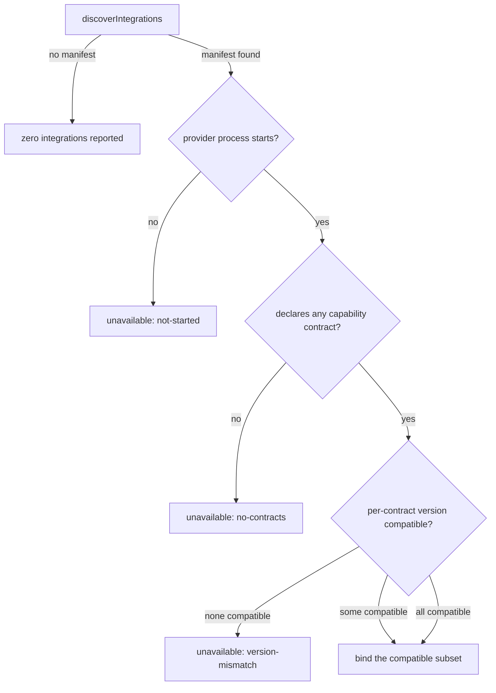
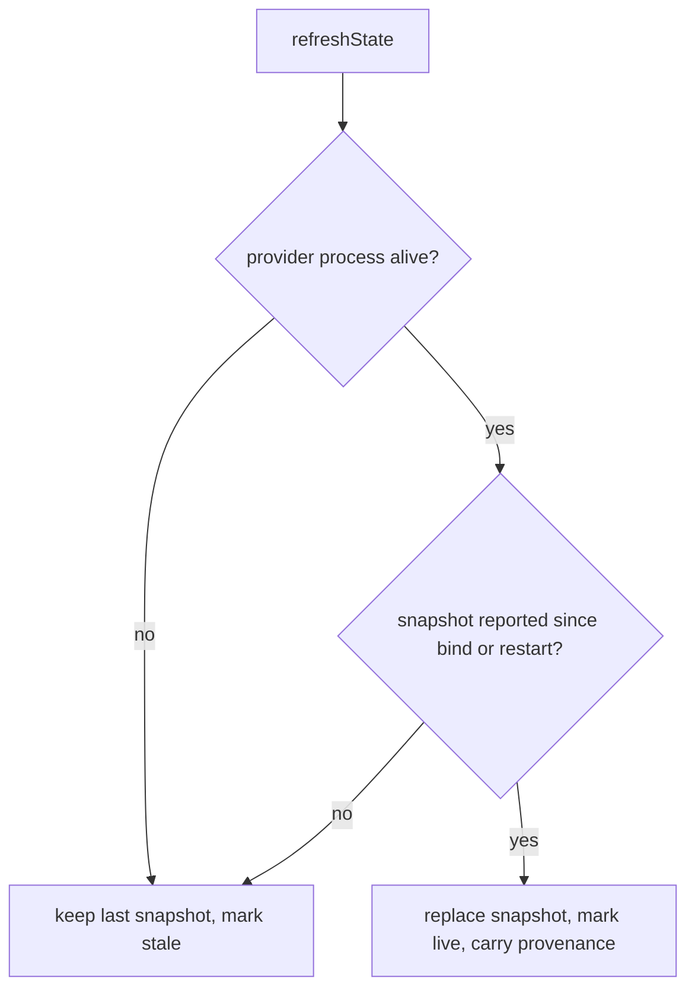
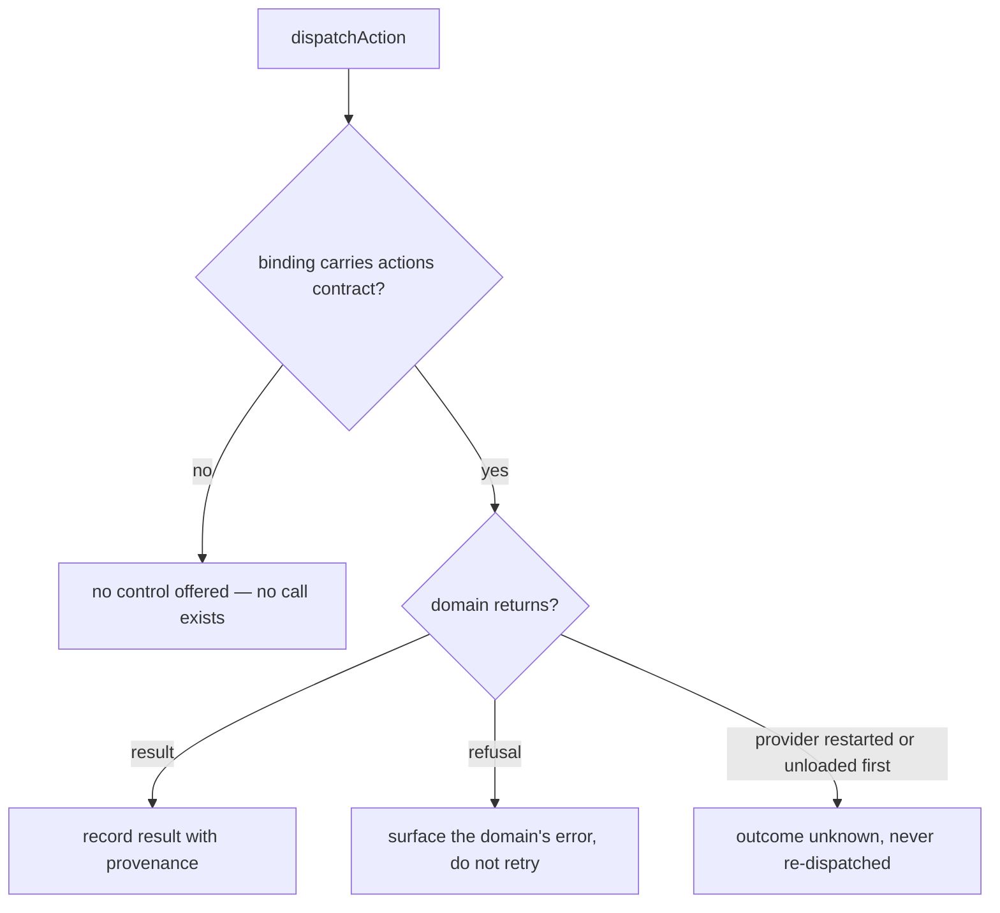
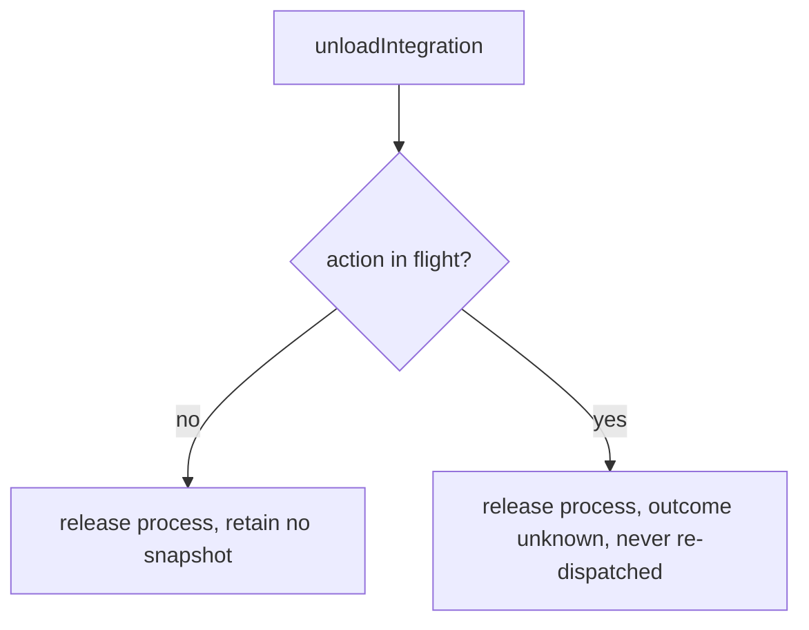

# Extension contract

## What

Command Center shows work that belongs to other systems. Cyberfleet knows which agents own
which project, SDD knows which missions passed which gates, and Truss knows which
obligations are still outstanding. The application renders all three in one place and owns
none of them.

The **extension contract** is the agreement that makes this possible: how the application
(the **host**) finds a domain's provider, checks it is compatible, holds a copy of what it
reports, sends it an action, and lets it go. A provider runs as **its own process**, with
its own lifetime — the host can be restarted without it, and it can be restarted without
the host.

The contract is **not one interface**. Every provider implements a small **handshake**;
beyond that it declares which of four **capability contracts** it implements, and the host
uses only those. A provider that reports state but offers no actions implements the state
contract and nothing else, and is never asked for an action it does not have.

| Capability contract | What it carries |
| --- | --- |
| `references` | How this domain's identifiers resolve, so a view can join facts across domains |
| `state` | Snapshots of what the domain currently holds |
| `views` | What the host may render for this domain |
| `actions` | Actions the domain owns, and their results and errors |

Each capability contract carries **its own version**. Compatibility is checked per
contract, not once for the whole provider — otherwise a change to `actions` would refuse a
provider that only ever reported state.

**Key terms**

- **Host** — Command Center, in its role as the thing a provider binds to.
- **Provider** — a domain's out-of-process implementation of some capability contracts.
- **Snapshot** — the host's copy of what a provider last reported. Always a copy, never
  the domain's record.
- **Live / stale** — whether the provider that produced a snapshot is still the running
  process the host is bound to. Time alone never changes this; neither does a restart.
- **Unavailable** — an explicit state the host renders for a provider it could not use,
  naming why. Distinct from a provider reporting nothing.
- **Provenance** — which provider a rendered fact came from, carried on every snapshot.

### Non-goals

- **Capability negotiation.** A provider carries its own dependencies, so installing it is
  acquiring the capability. No capability vocabulary, no `requires[]`, no `blocked` state
  (`docs/backlog.md`, *Settled — do not re-derive*).
- **A second copy of any authoritative model.** The host holds snapshots, never a mission
  graph, an ownership record, or an obligation store of its own.
- **Approval by rendering.** Showing a control is not granting one. The answer goes back
  to the domain that asked; the host records no verdict.
- **The Truss controller/probe contract.** That governs repository state continuously and
  is a different contract with a different lifetime. This one binds an application to a
  provider for as long as the application is open. They are not interchangeable, and
  nothing here settles which registry a Truss probe is discovered through.
- **A remote API.** Providers are local processes. Command Center is not an MCP server.

## Use Cases

### Actors and goals

| Actor | Reaches it how | Goal |
| --- | --- | --- |
| Integration author (Cyberfleet, SDD, Truss core) | Implements a provider | Publish their domain into the application without surrendering ownership of it |
| Host author | Calls the host API | Render composed state and dispatch actions without knowing any domain |
| Council member *(stakeholder — never invokes it)* | Reads a view | Trust that what they see is current, and that answering a decision does not act twice |
| Captain or Pod *(stakeholder — never invokes it)* | Receives a dispatched action | Never execute the same action twice because the application lost track of it |

The two stakeholders invoke nothing, and both of the contract's hardest requirements are
theirs: a stale snapshot must not read as live, and an action whose outcome is unknown must
not be sent again.

### `discoverIntegrations` — find the providers available here

- **Actor / goal** — host author; know which domains can be shown before opening anything.
- **Entry point** — called with a directory. Inputs: a starting directory. Outcome: the
  provider manifests found there, possibly none.
- **Extensions** — a directory with no provider is an ordinary outcome, not an error: the
  application runs with nothing to show and says so.

### `loadIntegration` — bind one provider

- **Actor / goal** — host author; obtain a usable binding, or a reason there is none.
- **Entry point** — called with one manifest. Inputs: a manifest. Outcome: a binding
  naming the capability contracts the host may use, or an unavailable state naming why not.
- **Extensions** — the provider process does not start; a capability contract's version is
  incompatible; every declared contract is incompatible; the provider declares no capability
  contract at all.

### `refreshState` — take a snapshot from a bound provider

- **Actor / goal** — host author; hold something current enough to render, and know when it
  is not.
- **Entry point** — called with a binding and a capability contract. Inputs: a binding.
  Outcome: a snapshot carrying its provenance and its freshness.
- **Extensions** — the provider process has exited; the provider has restarted and not yet
  reported; two providers' snapshots are joined into one view.

### `dispatchAction` — ask a domain to do something it owns

- **Actor / goal** — host author; deliver a Council member's answer to the domain that
  asked for it.
- **Entry point** — called with a binding and an action. Inputs: a binding, an action with
  its own identifier. Outcome: the domain's result, the domain's error, or an explicitly
  unknown outcome.
- **Extensions** — the domain refuses the action; the provider restarts while the action is
  in flight; the provider was unloaded while the action was in flight; the binding does not
  carry the `actions` contract, in which case there is no call to make.

### `unloadIntegration` — release a provider

- **Actor / goal** — host author; stop showing a domain and give back its process.
- **Entry point** — called with a binding. Inputs: a binding. Outcome: the process is
  released and the host retains no snapshot for it.
- **Extensions** — an action is in flight at the time.

### Public surface

| Element | Required by |
| --- | --- |
| `discoverIntegrations(dir)` | `discoverIntegrations` |
| `loadIntegration(manifest)` | `loadIntegration` |
| `Unavailable.reason` (`not-started` \| `version-mismatch` \| `no-contracts`) | `loadIntegration` extensions |
| `Binding.contracts` — the compatible declared subset | `loadIntegration`, and the bar on `dispatchAction` |
| `refreshState(binding, contract)` | `refreshState` |
| `Snapshot.provenance` | `refreshState`, and the Council member's goal |
| `Snapshot.freshness` (`live` \| `stale`) | `refreshState` extensions |
| `dispatchAction(binding, action)` | `dispatchAction` |
| `ActionOutcome` (`result` \| `domain-error` \| `unknown`) | `dispatchAction` extensions |
| `unloadIntegration(binding)` | `unloadIntegration` |

**Forbidden combination:** `dispatchAction` against a binding whose `contracts` omit
`actions`. The host offers no such control, so the call has no legitimate caller.

## Control Flow

### Bind

### State

### Action

### Unload

## Scenario map

### `discoverIntegrations`

| Edge | Path (Given) | Scenario |
| --- | --- | --- |
| no manifest | a directory holding no provider manifest | `discovery in a directory with no provider reports zero integrations` |
| manifest found | a directory holding two provider manifests | `discovery reports every provider manifest it finds` |

### `loadIntegration`

| Edge | Path (Given) | Scenario |
| --- | --- | --- |
| process starts → contracts declared → all compatible | a provider declaring state and actions at compatible versions | `a provider whose contracts are all compatible binds with all of them` |
| process starts → contracts declared → some compatible | a provider whose actions version is incompatible and state version is not | `a provider with one incompatible contract binds without it` |
| none compatible | a provider whose only contract is at an incompatible version | `a provider with no compatible contract is refused as a version mismatch` |
| process does not start | a manifest whose provider command exits immediately | `a provider that does not start is reported unavailable, not absent` |
| no contract declared | a provider that completes the handshake and declares no capability contract | `a provider declaring no capability contract is refused` |
| bind (convergence) | any provider that binds, whatever subset it declares | `the binding envelope does not vary with the declared subset` |

### `refreshState`

| Edge | Path (Given) | Scenario |
| --- | --- | --- |
| snapshot reported | a bound provider that has reported a snapshot | `a reported snapshot is rendered live and carries its provider as provenance` |
| process not alive | a bound provider whose process has exited | `a snapshot from an exited provider is kept and marked stale` |
| restarted, nothing reported yet | a bound provider that has restarted and reported nothing since | `a restart alone never promotes a stale snapshot to live` |
| snapshot reported (two providers) | two bound providers that have each reported a snapshot | `facts from two providers keep their own provenance in one view` |

### `dispatchAction`

| Edge | Path (Given) | Scenario |
| --- | --- | --- |
| actions contract absent | a binding whose contracts omit actions | `no action control is offered for a binding without the actions contract` |
| domain returns result | a binding carrying the actions contract | `an action the domain accepts returns its result with the domain as provenance` |
| domain refuses | a binding carrying the actions contract | `an action the domain refuses surfaces the domain's error and is not retried` |
| provider restarted in flight | an action dispatched before its provider restarted | `an action in flight across a provider restart is reported unknown and never re-dispatched` |
| domain returns result | a binding whose provider asked for a decision | `answering a decision returns the answer to the domain and records no host approval` |

### `unloadIntegration`

| Edge | Path (Given) | Scenario |
| --- | --- | --- |
| no action in flight | a bound provider with no action in flight | `unloading a provider releases its process and retains no snapshot` |
| action in flight | a bound provider with an action in flight | `unloading with an action in flight completes and reports the outcome unknown` |
