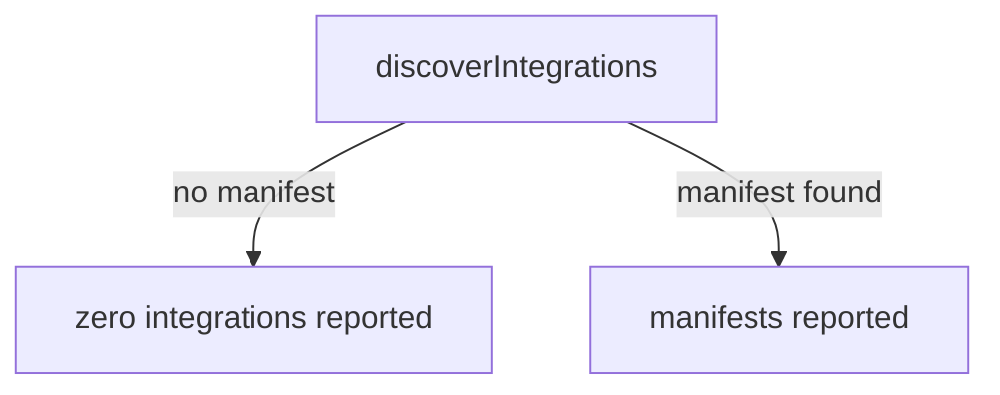
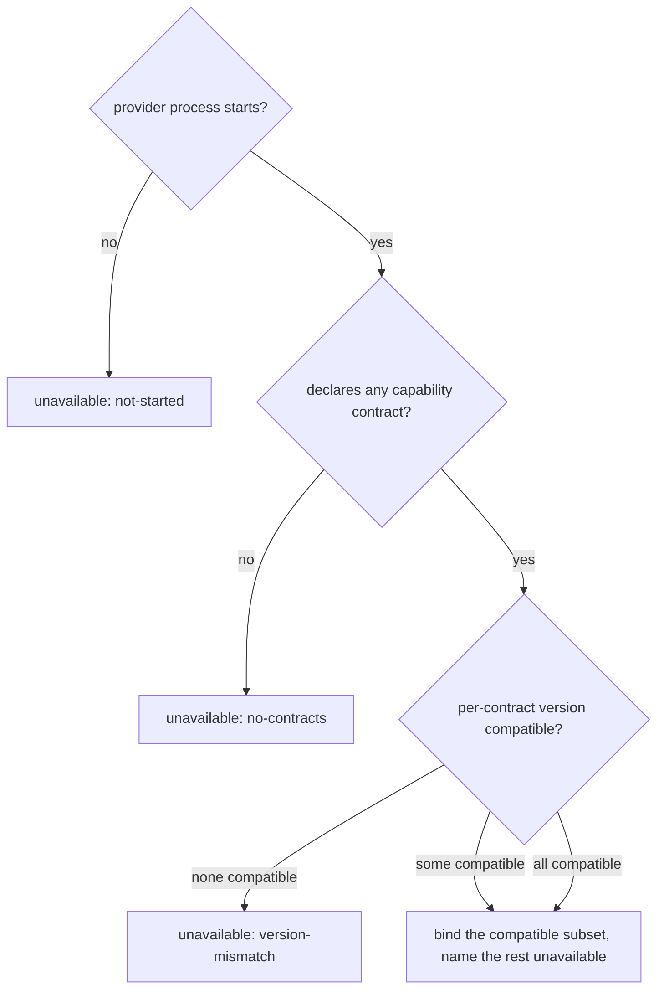
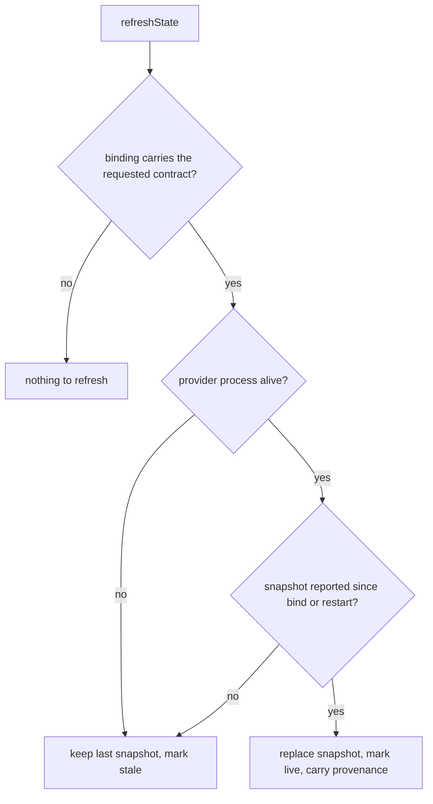
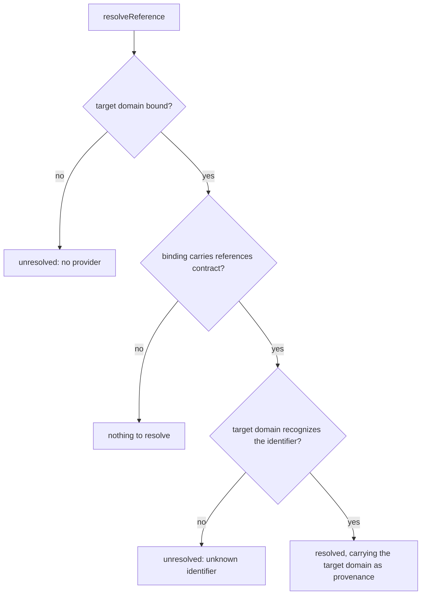
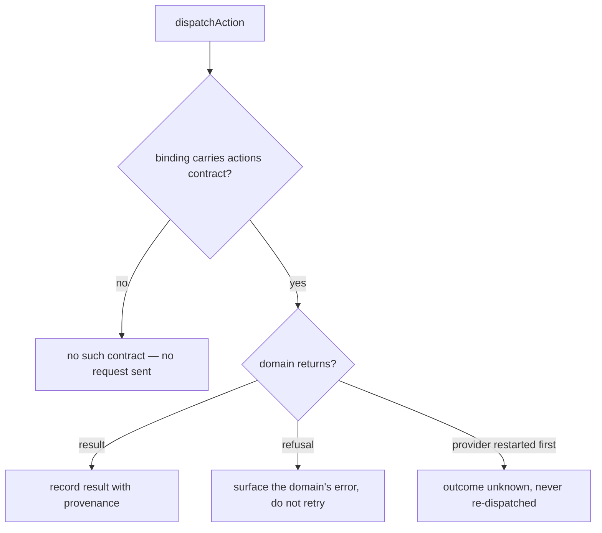
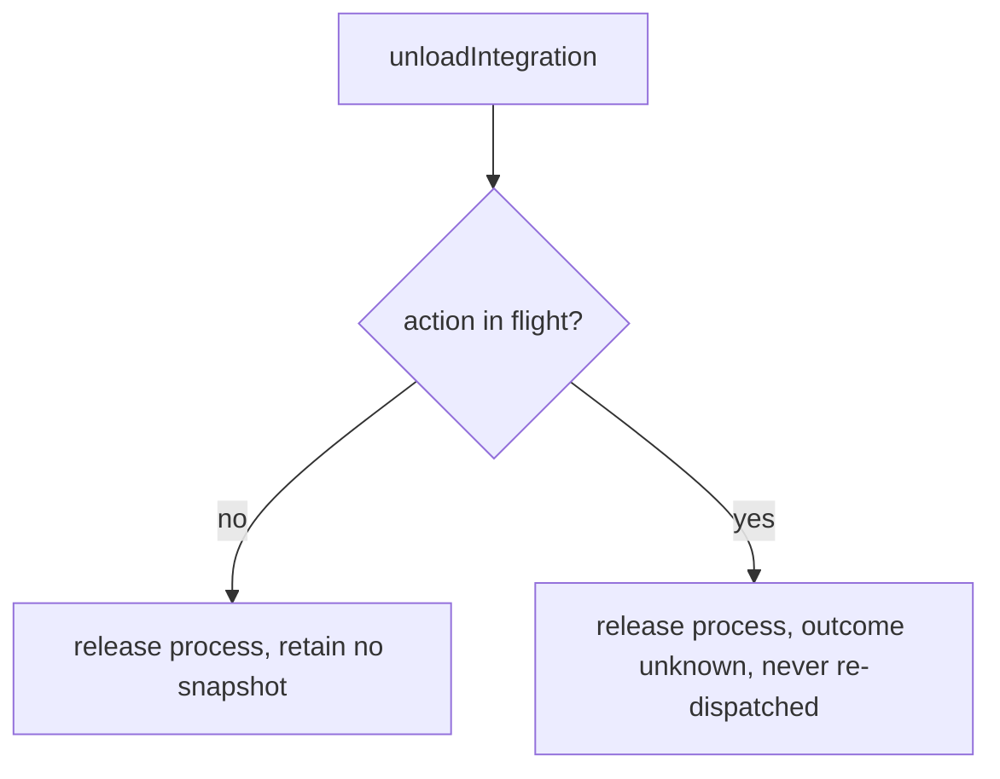

# Extension contract

## What

Command Center shows work that belongs to other systems. Cyberfleet knows which agents own
which project, SDD knows which missions passed which gates, and Truss knows which
obligations are still outstanding. The application renders all three in one place and owns
none of them.

The **extension contract** is the agreement that makes this possible: how the application
(the **host**) finds a domain's provider, checks it is compatible, follows a fact from one
domain into another, holds a copy of what each reports, sends one an action, and lets it
go. A provider runs as **its own process**, with its own lifetime — the host can be
restarted without it, and it can be restarted without the host.

The contract is **not one interface**. Every provider implements a small **handshake**;
beyond that it declares which **capability contracts** it implements, and the host uses
only those. A provider that reports state but offers no actions implements the state
contract and nothing else, and is never asked for an action it does not have.

| Capability contract | What it carries |
| --- | --- |
| `references` | How this domain's identifiers resolve, so a fact in one domain can be followed into another |
| `state` | Snapshots of what the domain currently holds |
| `actions` | Actions the domain owns, and their results and errors |

Each capability contract carries **its own version**. Compatibility is checked per
contract, not once for the whole provider — otherwise a change to `actions` would refuse a
provider that only ever reported state. A provider whose `state` is compatible and whose
`actions` is not therefore **binds without actions**, and the binding names that one
contract unavailable.

**Key terms**

- **Host** — Command Center, in its role as the thing a provider binds to.
- **Provider** — a domain's out-of-process implementation of some capability contracts.
- **Snapshot** — the host's copy of what a provider last reported. Always a copy, never
  the domain's record.
- **Live / stale** — whether the provider that produced a snapshot is still the running
  process the host is bound to. Time alone never changes this; neither does a restart.
- **Reference** — an identifier one domain holds for a fact another domain owns. Following
  it is the only way facts join across domains; the host never joins by guessing.
- **Unavailable** — an explicit state the host renders for a provider, or for one contract
  within a binding, that it could not use — naming why. Distinct from reporting nothing.
- **Provenance** — which provider a rendered fact came from, carried on every snapshot,
  resolution and action outcome.

### Non-goals

- **Capability negotiation.** A provider carries its own dependencies, so installing it is
  acquiring the capability. No capability vocabulary, no `requires[]`, no `blocked` state
  (`docs/backlog.md`, *Settled — do not re-derive*). Refusing one incompatible contract is
  not negotiation: the host omits it rather than adapting to it.
- **A second copy of any authoritative model.** The host holds snapshots, never a mission
  graph, an ownership record, or an obligation store of its own.
- **Approval by rendering.** Showing a control is not granting one. The answer goes back
  to the domain that asked; the host records no verdict.
- **A `views` contract.** An earlier draft declared one. Nothing here needs it: the host
  renders from `state` and follows `references`, and no use case yet asks a provider what
  it may render. Whether renderable views are a distinct area from state is a question the
  Command Center TUI (cyber-truss#8) will answer; declaring the contract before then is a
  commitment made before it has to be.
- **The Truss controller/probe contract.** That governs repository state continuously and
  is a different contract with a different lifetime. This one binds an application to a
  provider for as long as the application is open. They are not interchangeable, and
  nothing here settles which registry a Truss probe is discovered through.
- **A remote API.** Providers are local processes. Command Center is not an MCP server.

## Use Cases

### Actors and goals

| Actor | Reaches it how | Goal |
| --- | --- | --- |
| Host author | Calls the host API | Render composed state and dispatch actions without knowing any domain |
| Integration author (Cyberfleet, SDD, Truss core) *(stakeholder — never invokes it)* | Implements a provider | Release each area of their domain on its own schedule, and keep a fault in one area from taking the rest of their domain out of the application |
| Council member *(stakeholder — never invokes it)* | Reads a view | Trust that what they see is current, and that answering a decision does not act twice |
| Captain or Pod *(stakeholder — never invokes it)* | Receives a dispatched action | Never execute the same action twice because the application lost track of it |

Only the host author invokes this capability. The other three are stakeholders, and the
contract's three hardest requirements are all theirs: one area of a domain must not be able
to take down the others, a stale snapshot must not read as live, and an action whose
outcome is unknown must not be sent again.

### `discoverIntegrations` — find the providers available here

- **Actor / goal** — host author; know which domains can be shown before opening anything.
- **Entry point** — called with a directory. Inputs: a starting directory. Outcome: the
  provider manifests found there, possibly none.
- **Extensions** — a directory with no provider is an ordinary outcome, not an error: the
  application runs with nothing to show and says so.

### `loadIntegration` — bind one provider

- **Actor / goal** — host author; obtain a usable binding, or a reason there is none.
- **Entry point** — called with one manifest. Inputs: a manifest. Outcome: a binding
  naming the capability contracts the host may use, or an unavailable state naming why not.
- **Extensions** — the provider process does not start; one capability contract's version
  is incompatible while another's is not; every declared contract is incompatible; the
  provider declares no capability contract at all.

### `refreshState` — take a snapshot from a bound provider

- **Actor / goal** — host author; hold something current enough to render, and know when it
  is not.
- **Entry point** — called with a binding and a capability contract. Inputs: a binding, a
  contract. Outcome: a snapshot carrying its provenance and its freshness.
- **Extensions** — the binding does not carry the requested contract; the provider process
  has exited; the provider has restarted and not yet reported.

### `resolveReference` — follow a fact into the domain that owns it

- **Actor / goal** — host author; show one domain's fact alongside the other domain's fact
  it points at, without the host inventing the join.
- **Entry point** — called with a reference taken from a snapshot. Inputs: a reference
  naming a target domain and an identifier. Outcome: the target domain's own record for it,
  carrying that domain as provenance, or an explicit unresolved state.
- **Extensions** — no provider for the target domain is bound; the target binding does not
  carry the `references` contract; the target domain does not recognize the identifier.

### `dispatchAction` — ask a domain to do something it owns

- **Actor / goal** — host author; deliver a Council member's answer to the domain that
  asked for it.
- **Entry point** — called with a binding and an action. Inputs: a binding, an action with
  its own identifier. Outcome: the domain's result, the domain's error, or an explicitly
  unknown outcome.
- **Extensions** — the domain refuses the action; the provider restarts while the action is
  in flight; the binding does not carry the `actions` contract, in which case there is no
  call to make. Unloading during an action is `unloadIntegration`'s divergence, not this
  one's — it is reached from that entry point.

### `unloadIntegration` — release a provider

- **Actor / goal** — host author; stop showing a domain and give back its process.
- **Entry point** — called with a binding. Inputs: a binding. Outcome: the process is
  released and the host retains no snapshot for it.
- **Extensions** — an action is in flight at the time.

### Public surface

| Element | Required by |
| --- | --- |
| `discoverIntegrations(dir)` | `discoverIntegrations` |
| `loadIntegration(manifest)` | `loadIntegration` |
| `Unavailable.reason` (`not-started` \| `version-mismatch` \| `no-contracts`) | `loadIntegration` extensions |
| `Binding.contracts` — the compatible declared subset | `loadIntegration`, and the bars on `refreshState` and `dispatchAction` |
| `Binding.unavailable[]` — each declared contract the host could not use, with its reason | `loadIntegration`'s one-incompatible-contract extension |
| `refreshState(binding, contract)` | `refreshState` |
| `Snapshot.provenance` | `refreshState`, `resolveReference`, and the Council member's goal |
| `Snapshot.freshness` (`live` \| `stale`) | `refreshState` extensions |
| `Reference` — a target domain and an identifier | `resolveReference` |
| `resolveReference(reference)` | `resolveReference` |
| `Resolution` (`resolved` \| `unresolved`) | `resolveReference` extensions |
| `dispatchAction(binding, action)` | `dispatchAction` |
| `ActionOutcome` (`result` \| `domain-error` \| `unknown`) | `dispatchAction` extensions |
| `Snapshot` as the only source of a decision's state | `dispatchAction`'s answer path — the host adds no verdict of its own |
| `unloadIntegration(binding)` | `unloadIntegration` |

**Forbidden combinations:** `refreshState` or `dispatchAction` against a binding whose
`contracts` omit the contract being asked for. The host offers no such control, so neither
call has a legitimate caller — and each is refused by a guard the graph carries rather than
by prose.

## Control Flow

### Discover

### Bind

### State

### References

### Action

### Unload

## Scenario map

### `discoverIntegrations`

| Edge | Path (Given) | Scenario |
| --- | --- | --- |
| no manifest | a directory holding no provider manifest | `discovery in a directory with no provider reports zero integrations` |
| manifest found | a directory holding two provider manifests | `discovery reports every provider manifest it finds` |

### `loadIntegration`

| Edge | Path (Given) | Scenario |
| --- | --- | --- |
| all compatible | a provider declaring state and actions at compatible versions | `a provider whose contracts are all compatible binds with all of them` |
| some compatible | a provider with one compatible and one incompatible contract | `a provider with one incompatible contract binds without it` |
| none compatible | a provider whose only contract is at an incompatible version | `a provider with no compatible contract is refused as a version mismatch` |
| process does not start | a manifest whose provider command exits immediately | `a provider that does not start is reported unavailable, not absent` |
| no contract declared | a provider that completes the handshake and declares an empty contract list | `a provider declaring no capability contract is refused` |
| bind (convergence) | any provider that binds, whatever subset it declares | `the binding envelope does not vary with the declared subset` |

### `refreshState`

| Edge | Path (Given) | Scenario |
| --- | --- | --- |
| contract absent from binding | a binding that lists the state contract only | `refreshing a contract absent from the binding reports nothing to refresh` |
| snapshot reported | a bound provider that has reported a snapshot | `a reported snapshot is rendered live and carries its provider as provenance` |
| process not alive | a bound provider whose process has exited | `a snapshot from an exited provider is kept and marked stale` |
| restarted, nothing reported yet | a bound provider that has restarted and reported nothing since | `a restart alone never promotes a stale snapshot to live` |
| snapshot reported | three bound providers that have each reported a snapshot | `facts from three domains keep their own provenance when held together` |

### `resolveReference`

| Edge | Path (Given) | Scenario |
| --- | --- | --- |
| identifier recognized | a fleet snapshot carrying a reference into the sdd domain | `a reference into another domain resolves through that domain's binding` |
| target domain not bound | a fleet snapshot carrying a reference into an unbound domain | `a reference into an unbound domain is reported unresolved` |
| references contract absent | a target binding that lists the state contract only | `resolving through a binding without the references contract reports nothing to resolve` |
| identifier not recognized | a truss binding that does not recognize an obligation identifier | `a reference the target domain does not recognize is reported unresolved` |

### `dispatchAction`

| Edge | Path (Given) | Scenario |
| --- | --- | --- |
| actions contract absent | a binding whose contracts omit actions | `dispatching on a binding without the actions contract reports no such contract` |
| domain returns result | a binding carrying the actions contract | `an action the domain accepts returns its result with the domain as provenance` |
| domain refuses | a binding carrying the actions contract | `an action the domain refuses surfaces the domain's error and is not retried` |
| provider restarted in flight | an action dispatched before its provider restarted | `an action in flight across a provider restart is reported unknown and never re-dispatched` |
| domain returns result | a binding whose provider asked for a decision | `a decision stays as its provider last reported it until that provider reports otherwise` |

### `unloadIntegration`

| Edge | Path (Given) | Scenario |
| --- | --- | --- |
| no action in flight | a bound provider with no action in flight | `unloading a provider releases its process and retains no snapshot` |
| action in flight | a bound provider with an action in flight | `unloading with an action in flight completes and reports the outcome unknown` |
