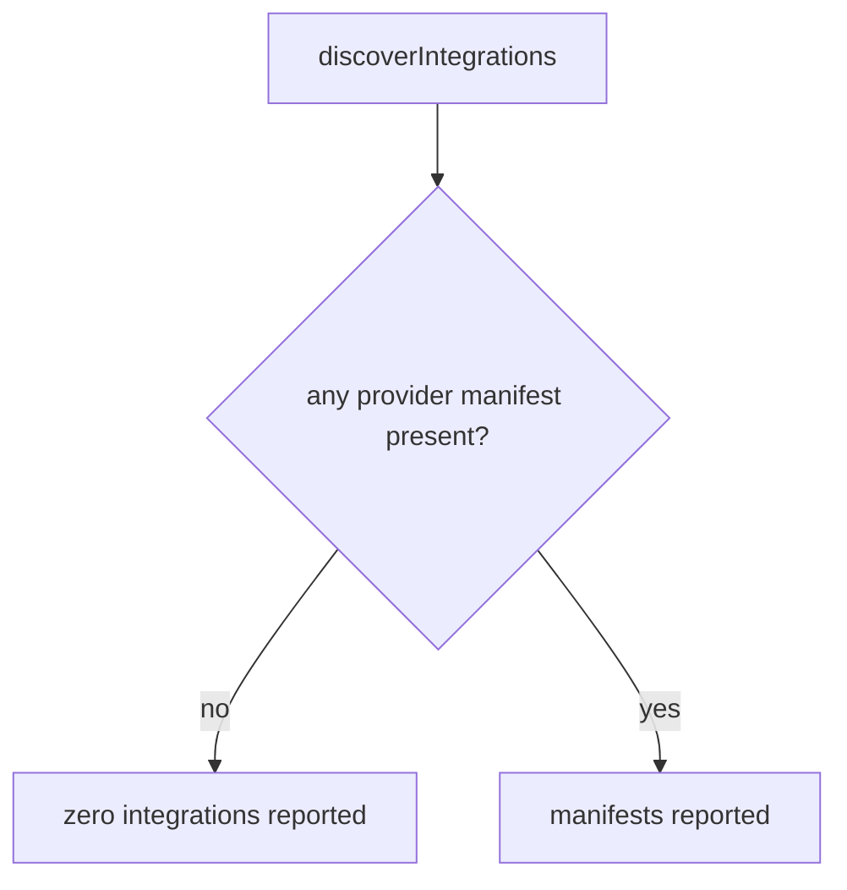
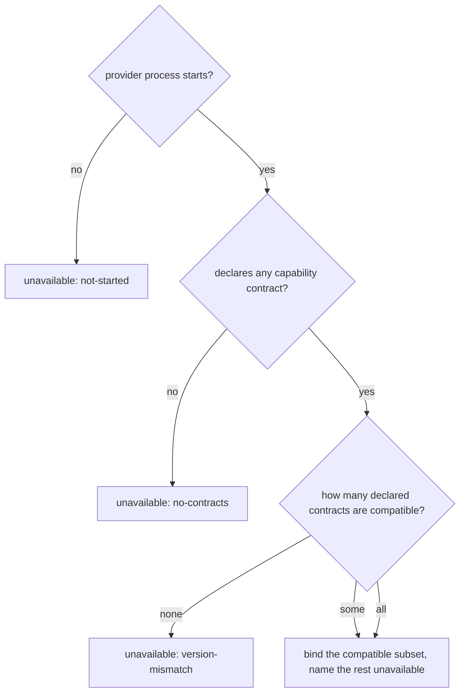
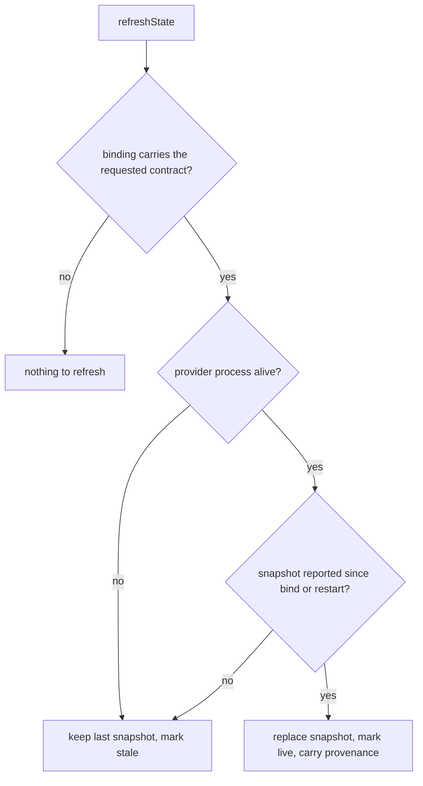
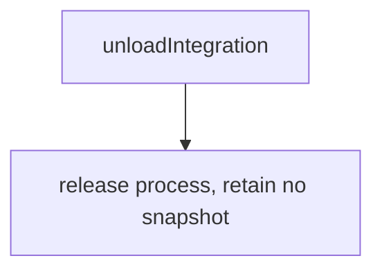

# Provider binding

## What

Command Center shows work that belongs to other systems, and owns none of it. Before it can
show anything it has to find a domain's provider, check it is compatible, and hold what it
reports without ever overstating how current that is.

This node owns the **life of a binding**: discovering a provider, starting it, agreeing what
may be asked of it, holding its snapshots, and releasing it. A provider runs as **its own
process**, with its own lifetime — the host can be restarted without it, and it can be
restarted without the host. What you may *do* with a binding once you have one is
[provider exchange](../provider-exchange/README.md).

The contract is **not one interface**. Every provider implements a small **handshake**;
beyond that it declares which capability contracts it carries, and the host uses only
those. A provider that reports state but offers no actions implements the state contract
and nothing else, and is never asked for an action it does not have.

| Capability contract | What it carries |
| --- | --- |
| `references` | How this domain's identifiers resolve, so a fact in one domain can be followed into another |
| `state` | Snapshots of what the domain currently holds |
| `actions` | Actions the domain owns, and their results and errors |

Each capability contract carries **its own version**. Compatibility is checked per
contract, not once for the whole provider — otherwise a change to `actions` would refuse a
provider that only ever reported state. A provider whose `state` is compatible and whose
`actions` is not therefore **binds without actions**, and the binding names that one
contract unavailable.

**Key terms**

- **Host** — Command Center, in its role as the thing a provider binds to.
- **Provider** — a domain's out-of-process implementation of some capability contracts.
- **Snapshot** — the host's copy of what a provider last reported. Always a copy, never
  the domain's record.
- **Live / stale** — whether the provider that produced a snapshot is still the running
  process the host is bound to. Time alone never changes this; neither does a restart.
- **Unavailable** — an explicit state the host renders for a provider, or for one contract
  within a binding, that it could not use — naming why. Distinct from reporting nothing.
- **Provenance** — which provider a rendered fact came from, carried on every snapshot.

### How far isolation reaches, and where it stops

An incompatible contract is refused without removing the provider's other contracts, and a
refused or exited provider leaves every other provider's binding untouched. It stops at the
process: a provider's contracts share one process, so when that process exits, everything it
carried goes stale together. That is a consequence of out-of-process providers, not a gap —
a domain wanting two areas to fail independently ships two providers.

### Non-goals

- **Capability negotiation.** A provider carries its own dependencies, so installing it is
  acquiring the capability. No capability vocabulary, no `requires[]`, no `blocked` state
  (`docs/backlog.md`, *Settled — do not re-derive*). Refusing one incompatible contract is
  not negotiation: the host omits it rather than adapting to it.
- **A second copy of any authoritative model.** The host holds snapshots, never a mission
  graph, an ownership record, or an obligation store of its own.
- **A `views` contract.** Nothing needs one: the host renders from `state` and follows
  `references`, and no use case asks a provider what it may render. Whether renderable
  views are a distinct area is a question the TUI (cyber-truss#8) will answer.
- **The Truss controller/probe contract.** That governs repository state continuously and
  is a different contract with a different lifetime. They are not interchangeable, and
  nothing here settles which registry a Truss probe is discovered through.
- **A remote API.** Providers are local processes. Command Center is not an MCP server.

## Use Cases

### Actors and goals

| Actor | Reaches it how | Goal |
| --- | --- | --- |
| Host author | Calls the host API | Obtain usable bindings, and know when what they hold is no longer current |
| Integration author (Cyberfleet, SDD, Truss core) *(stakeholder — never invokes it)* | Implements a provider | Release each area of their domain on its own schedule, and keep a fault in one area from taking the rest out of the application |
| Council member *(stakeholder — never invokes it)* | Reads a view | Trust that what they see is current, and be told plainly when it is not |

Only the host author invokes this capability. The other two are stakeholders, and this
node's two hardest requirements are theirs: a failure must not spread past the thing that
failed, and a stale snapshot must never read as live.

### `discoverIntegrations` — find the providers available here

- **Actor / goal** — host author; know which domains can be shown before opening anything.
- **Entry point** — called with a directory. Inputs: a starting directory. Outcome: the
  provider manifests found there, possibly none.
- **Extensions** — a directory with no provider is an ordinary outcome, not an error: the
  application runs with nothing to show and says so.

### `loadIntegration` — bind one provider

- **Actor / goal** — host author; obtain a usable binding, or a reason there is none.
- **Entry point** — called with one manifest. Inputs: a manifest. Outcome: a binding
  naming the capability contracts the host may use, or an unavailable state naming why not.
- **Extensions** — the provider process does not start; one capability contract's version
  is incompatible while another's is not; every declared contract is incompatible; the
  provider declares no capability contract at all.

### `refreshState` — take a snapshot from a bound provider

- **Actor / goal** — host author; hold something current enough to render, and know when it
  is not.
- **Entry point** — called with a binding and a capability contract. Inputs: a binding, a
  contract. Outcome: a snapshot carrying its provenance and its freshness.
- **Extensions** — the binding does not carry the requested contract; the provider process
  has exited; the provider has restarted and not yet reported.

### `unloadIntegration` — release a provider

- **Actor / goal** — host author; stop showing a domain and give back its process.
- **Entry point** — called with a binding. Inputs: a binding. Outcome: the process is
  released and the host retains no snapshot for it.
- **Extensions** — none. Releasing a provider always succeeds; what happens to an action
  that was in flight is [provider exchange](../provider-exchange/README.md)'s, because its
  outcome is a property of the action rather than of the release.

### Public surface

| Element | Required by |
| --- | --- |
| `discoverIntegrations(dir)` | `discoverIntegrations` |
| `loadIntegration(manifest)` | `loadIntegration` |
| `Unavailable.reason` (`not-started` \| `version-mismatch` \| `no-contracts`) | `loadIntegration` extensions |
| `Binding.contracts` — the compatible declared subset | `loadIntegration`, and the bar on `refreshState` |
| `Binding.unavailable[]` — each declared contract the host could not use, with its reason | `loadIntegration`'s one-incompatible-contract extension |
| `refreshState(binding, contract)` | `refreshState` |
| `Snapshot.provenance` | `refreshState`, and the Council member's goal |
| `Snapshot.freshness` (`live` \| `stale`) | `refreshState` extensions |
| `unloadIntegration(binding)` | `unloadIntegration` |

**Forbidden combination:** `refreshState` against a binding whose `contracts` omit the
contract being asked for. The host offers no such control, so the call has no legitimate
caller — and it is refused by a guard the graph carries rather than by prose.

## Control Flow

### Discover

### Bind

### State

### Unload

Single-branch: releasing a provider ends its process and drops the host's snapshot for it.

## Scenario map

### `discoverIntegrations`

| Edge | Path (Given) | Scenario |
| --- | --- | --- |
| no manifest | a directory holding no provider manifest | `discovery in a directory with no provider reports zero integrations` |
| manifest found | a directory holding two provider manifests | `discovery reports every provider manifest it finds` |

### `loadIntegration`

| Edge | Path (Given) | Scenario |
| --- | --- | --- |
| all compatible | a provider declaring state and actions at compatible versions | `a provider whose contracts are all compatible binds with all of them` |
| all compatible (convergence) | another provider in the same pass was refused | `refusing one provider still binds another loaded in the same pass` |
| some compatible | a provider with one compatible and one incompatible contract | `a provider with one incompatible contract binds without it` |
| none compatible | a provider whose only contract is at an incompatible version | `a provider with no compatible contract is refused as a version mismatch` |
| process does not start | a manifest whose provider command exits immediately | `a provider that does not start is reported unavailable, not absent` |
| no contract declared | a provider that completes the handshake and declares an empty contract list | `a provider declaring no capability contract is refused` |
| bind (convergence) | any provider that binds, whatever subset it declares | `the binding envelope does not vary with the declared subset` |

### `refreshState`

| Edge | Path (Given) | Scenario |
| --- | --- | --- |
| contract absent from binding | a binding that lists the state contract only | `refreshing a contract absent from the binding reports nothing to refresh` |
| snapshot reported | a bound provider that has reported a snapshot | `a reported snapshot is rendered live and carries its provider as provenance` |
| snapshot reported | three bound providers that have each reported a snapshot | `facts from three domains keep their own provenance when held together` |
| snapshot reported (convergence) | another bound provider's process has exited | `one provider's exit does not make another provider's snapshot stale` |
| process not alive | a bound provider whose process has exited | `a snapshot from an exited provider is kept and marked stale` |
| restarted, nothing reported yet | a bound provider that has restarted and reported nothing since | `a restart alone never promotes a stale snapshot to live` |

### `unloadIntegration`

| Edge | Path (Given) | Scenario |
| --- | --- | --- |
| release | a bound provider that has reported a snapshot | `unloading a provider releases its process and retains no snapshot` |
