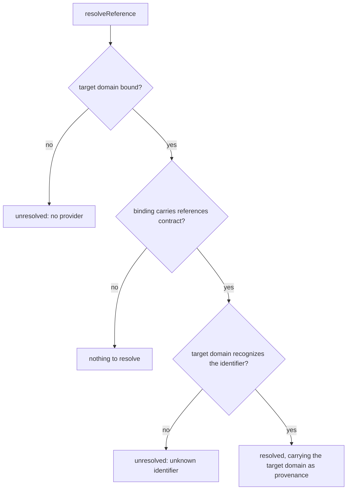
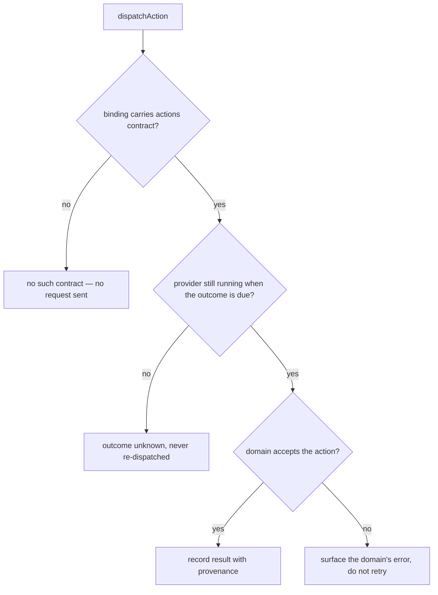

# Provider exchange

## What

Once the host holds a binding, two things can pass across it that a snapshot cannot carry
on its own: a **reference** followed into the domain that owns it, and an **action** the
domain is asked to perform.

Obtaining and holding a binding is [provider binding](../provider-binding/README.md). This
node owns what travels over one.

Both directions turn on the same fact: the provider is a **separate process** with its own
lifetime. Following a reference can fail because the target domain is not bound at all.
Dispatching an action can end with the host genuinely not knowing what happened — the
provider may have restarted, or been released, between receiving the action and answering.
An unknown outcome is reported as unknown and the action is **never sent again**, because
the alternative is a domain executing the same instruction twice.

**Key terms**

- **Reference** — an identifier one domain holds for a fact another domain owns. Following
  it is the only way facts join across domains; the host never joins by guessing.
- **Resolution** — the result of following a reference: the target domain's own record, or
  an explicit unresolved state naming why not.
- **Action outcome** — a result, the domain's own error, or **unknown**. Unknown is a real
  outcome, not a failure to produce one.
- **Provenance** — which provider a resolution or an outcome came from.

### Non-goals

- **Retrying.** Neither a refusal nor an unknown outcome is retried by the host. A refusal
  is the domain's answer; an unknown outcome is precisely the case where retrying could act
  twice.
- **Approval by rendering.** Showing a control is not granting one. The answer goes back to
  the domain that asked; the host records no verdict of its own.
- **Joining domains without a reference.** The host never infers that two facts are related.

## Use Cases

### Actors and goals

| Actor | Reaches it how | Goal |
| --- | --- | --- |
| Host author | Calls the host API | Show one domain's fact alongside the fact it points at, and deliver an answer to the domain that asked for it |
| Captain or Pod *(stakeholder — never invokes it)* | Receives a dispatched action | Never execute the same action twice because the application lost track of it |
| Council member *(stakeholder — never invokes it)* | Answers a decision | Have the answer reach the domain, and have nothing claim it was accepted before that domain says so |

Only the host author invokes this capability. The hardest requirement in this node belongs
to a stakeholder who never calls it: an action whose outcome is unknown must not be sent a
second time.

### `resolveReference` — follow a fact into the domain that owns it

- **Actor / goal** — host author; show one domain's fact alongside the other domain's fact
  it points at, without the host inventing the join.
- **Entry point** — called with a reference taken from a snapshot. Inputs: a reference
  naming a target domain and an identifier. Outcome: the target domain's own record for it,
  carrying that domain as provenance, or an explicit unresolved state.
- **Extensions** — no provider for the target domain is bound; the target binding does not
  carry the `references` contract; the target domain does not recognize the identifier.

### `dispatchAction` — ask a domain to do something it owns

- **Actor / goal** — host author; deliver a Council member's answer to the domain that
  asked for it.
- **Entry point** — called with a binding and an action. Inputs: a binding, an action with
  its own identifier. Outcome: the domain's result, the domain's error, or an explicitly
  unknown outcome.
- **Extensions** — the domain refuses the action; the provider restarts while the action is
  in flight; the provider is unloaded while the action is in flight; the binding does not
  carry the `actions` contract, in which case there is no call to make.

### Public surface

| Element | Required by |
| --- | --- |
| `Reference` — a target domain and an identifier | `resolveReference` |
| `resolveReference(reference)` | `resolveReference` |
| `Resolution` (`resolved` \| `unresolved`) | `resolveReference` extensions |
| `dispatchAction(binding, action)` | `dispatchAction` |
| `ActionOutcome` (`result` \| `domain-error` \| `unknown`) | `dispatchAction` extensions |
| `Snapshot` as the only source of a decision's state | `dispatchAction`'s answer path — the host adds no verdict of its own |

**Forbidden combination:** `resolveReference` or `dispatchAction` against a binding whose
`contracts` omit the contract being asked for. The host offers no such control, so neither
call has a legitimate caller — and each is refused by a guard the graph carries rather than
by prose.

## Control Flow

### References

### Action

The provider stops running for either of two reasons — it restarted, or it was released —
and the outcome is the same, which is why one edge carries both.

## Scenario map

### `resolveReference`

| Edge | Path (Given) | Scenario |
| --- | --- | --- |
| identifier recognized | a fleet snapshot carrying a reference into the sdd domain | `a reference into another domain resolves through that domain's binding` |
| target domain not bound | a fleet snapshot carrying a reference into an unbound domain | `a reference into an unbound domain is reported unresolved` |
| references contract absent | a target binding that lists the state contract only | `resolving through a binding without the references contract reports nothing to resolve` |
| identifier not recognized | a truss binding that does not recognize an obligation identifier | `a reference the target domain does not recognize is reported unresolved` |

### `dispatchAction`

| Edge | Path (Given) | Scenario |
| --- | --- | --- |
| actions contract absent | a binding whose contracts omit actions | `dispatching on a binding without the actions contract reports no such contract` |
| domain accepts | a binding carrying the actions contract | `an action the domain accepts returns its result with the domain as provenance` |
| domain accepts | a binding whose provider asked for a decision | `a decision stays as its provider last reported it until that provider reports otherwise` |
| domain does not accept | a binding carrying the actions contract | `an action the domain refuses surfaces the domain's error and is not retried` |
| provider not running when due | an action dispatched before its provider restarted | `an action in flight across a provider restart is reported unknown and never re-dispatched` |
| provider not running when due | an action dispatched before its provider was unloaded | `an action in flight when its provider is unloaded is reported unknown and never re-dispatched` |
